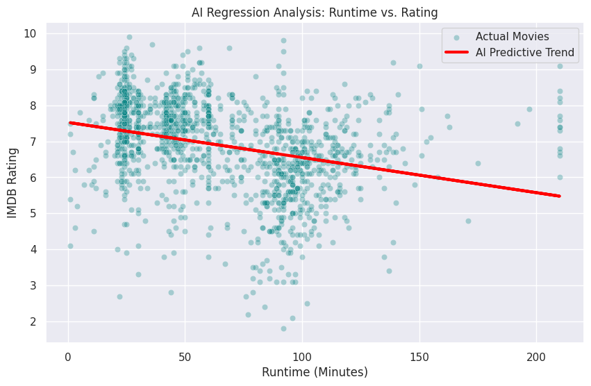

# AI Regression Model: Predicting Movie Ratings
*A Machine Learning Implementation using Scikit-Learn*

## The Objective
This project implements a supervised machine learning pipeline to determine if a movie's runtime can accurately predict its final IMDB audience rating. The model processes a pre-cleaned dataset of movies and television shows to find mathematical correlations.

## Tech Stack & Methodology
* **Language:** Python
* **Libraries:** Pandas, Scikit-Learn, Matplotlib, Seaborn
* **Model:** Linear Regression
* **Pipeline:** Feature isolation (X) vs. Target (y) -> Train/Test Split (80/20) -> Model Fitting -> Prediction & Evaluation.

## Model Evaluation Metrics
* **Mean Absolute Error (MAE):** ~0.90
  * *Interpretation:* When the AI guesses a movie's rating, it is typically off by less than one full star.
* **R-Squared ($R^2$):** ~0.00
  * *Interpretation:* The model explains near-zero variance in the target variable, indicating no linear relationship.

## The Visual Report

## Strategic Insights (C.I.R.)
* **Context:** This model was trained to find a predictive pattern between how long a movie is and how highly audiences rate it.
* **Insight:** The near-zero $R^2$ score mathematically proves a fascinating industry reality: **a movie's length has absolutely zero correlation to its quality.** The AI successfully determined that the pattern it was asked to find does not exist.
* **Recommendation:** From a production standpoint, studios should not artificially extend runtimes under the assumption it will yield higher audience satisfaction or prestige. Investment should remain strictly on script and production quality.
